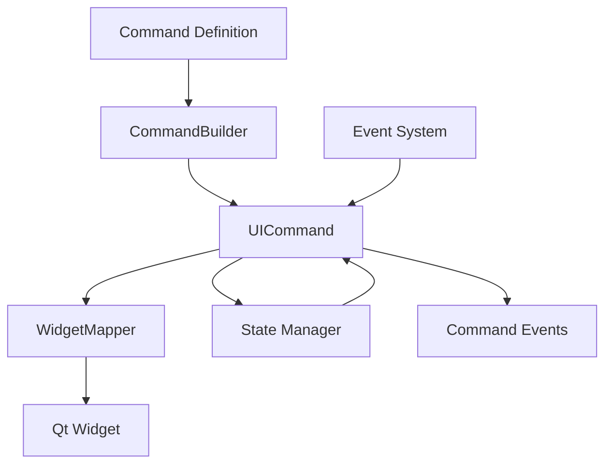

# Command System

The Command System represents the next evolution in Qt UI development, providing a modern alternative to traditional widget-based approaches with clear separation of concerns.

## Overview

The Command System separates UI logic from widget implementation, enabling:

- **Framework Independence**: Commands work without direct Qt dependencies
- **Testability**: UI logic can be unit tested without widgets
- **Flexibility**: Easy switching between different UI backends
- **Maintainability**: Clear separation of concerns

## Core Concepts

### Commands vs Components

| Aspect             | Components                | Commands              |
| ------------------ | ------------------------- | --------------------- |
| **Approach**       | Widget-centric            | Logic-centric         |
| **Dependencies**   | Direct Qt coupling        | Framework independent |
| **Testing**        | Requires Qt widgets       | Pure logic testing    |
| **Flexibility**    | Qt-specific               | Backend agnostic      |
| **Learning Curve** | Familiar to Qt developers | New paradigm          |

### Command Architecture



## Basic Usage

### Creating Commands

```cpp
#include "Command/CommandBuilder.hpp"
using namespace DeclarativeUI::Command;

// Create a simple button command
auto buttonCommand = CommandBuilder("Button")
    .text("Click Me")
    .property("enabled", true)
    .addEventListener("click", [](const CommandEvent& event) {
        qDebug() << "Button clicked!";
    })
    .build();

// Convert to Qt widget
auto widget = WidgetMapper::instance().toWidget(buttonCommand);
```

### Command Hierarchies

Build complex UIs with hierarchical commands:

```cpp
auto dashboard = CommandHierarchyBuilder("Container")
    .layout("VBox")
    .spacing(15)
    .margins(20)
    .addChild("Label", [](CommandBuilder& header) {
        header.text("📊 Application Dashboard")
              .style("font-size: 24px; font-weight: bold;")
              .alignment(Qt::AlignCenter);
    })
    .addChild("Container", [](CommandBuilder& stats) {
        stats.layout("HBox")
             .spacing(20)
             .child(CommandBuilder("Label")
                   .text("👥 Users: 1,234")
                   .style("background: #3498db; color: white; padding: 15px;"))
             .child(CommandBuilder("Label")
                   .text("💰 Revenue: $12,345")
                   .style("background: #2ecc71; color: white; padding: 15px;"));
    })
    .build();
```

## State Integration

Commands integrate seamlessly with the state management system:

### Two-Way Binding

```cpp
// Bind command properties to state
auto input = CommandBuilder("TextInput")
    .placeholder("Enter your name")
    .bindToState("user.name", "text")  // Two-way binding
    .build();

// State changes automatically update the UI
StateManager::instance().setState("user.name", "John Doe");
// Input field now displays "John Doe"

// User input automatically updates state
// When user types, state is updated automatically
```

### Computed Properties

```cpp
auto label = CommandBuilder("Label")
    .bindToState("user.displayName", "text", [](const QVariant& firstName, const QVariant& lastName) {
        return QString("%1 %2").arg(firstName.toString(), lastName.toString());
    }, {"user.firstName", "user.lastName"})
    .build();
```

## Event System

The Command event system provides powerful event handling capabilities:

### Event Registration

```cpp
auto button = CommandBuilder("Button")
    .text("Save Document")
    .addEventListener("click", [](const CommandEvent& event) {
        // Access event data
        auto modifiers = event.getData("modifiers").value<Qt::KeyboardModifiers>();
        auto position = event.getData("position").toPoint();

        if (modifiers & Qt::ControlModifier) {
            // Save as...
        } else {
            // Regular save
        }
    })
    .build();
```

### Event Priorities

```cpp
// High priority event handler (executes first)
button->addEventListener("click", highPriorityHandler, EventPriority::High);

// Normal priority handler
button->addEventListener("click", normalHandler, EventPriority::Normal);

// Low priority handler (executes last)
button->addEventListener("click", lowPriorityHandler, EventPriority::Low);
```

## JSON Loading

Load complete UIs from JSON definitions:

### JSON Definition

```json
{
  "type": "Container",
  "properties": {
    "layout": "VBox",
    "spacing": 10,
    "margins": [20, 20, 20, 20]
  },
  "children": [
    {
      "type": "Label",
      "properties": {
        "text": "Welcome to DeclarativeUI",
        "alignment": "AlignCenter"
      }
    },
    {
      "type": "Button",
      "properties": {
        "text": "Get Started"
      },
      "events": {
        "click": "handleGetStarted"
      }
    }
  ]
}
```

### Loading Code

```cpp
#include "Command/Adapters/JSONCommandLoader.hpp"

JSONCommandLoader loader;

// Register event handlers
loader.registerEventHandler("handleGetStarted", [](const CommandEvent& event) {
    qDebug() << "Getting started...";
});

// Load UI from JSON
auto [command, widget] = loader.loadCommandWithWidgetFromFile("ui/welcome.json");
widget->show();
```

## Legacy Integration

The Command System provides comprehensive adapters for gradual migration from existing Qt code:

### Component to Command Conversion

```cpp
#include "Command/Adapters/ComponentSystemAdapter.hpp"

// Convert existing Components to Commands
auto legacyButton = std::make_unique<Components::Button>();
legacyButton->text("Legacy Button");

auto commandButton = ComponentSystemAdapter::instance()
    .convertToCommand(legacyButton.get());

// Establish bidirectional synchronization
ComponentSystemAdapter::instance()
    .establishSync(legacyButton.get(), commandButton);
```

### Hybrid Containers

```cpp
// Mix Components and Commands in the same container
auto hybrid = ComponentSystemAdapter::instance().createHybridContainer();
hybrid->setLayout("VBox");
hybrid->addComponent(std::move(legacyButton));
hybrid->addCommand(CommandBuilder("Button").text("Command Button").build());

auto widget = hybrid->toWidget();
```

## Advanced Features

### Custom Command Types

```cpp
// Register custom command mappings
WidgetMapper::instance().registerMapping<QSlider>("CustomSlider");

// Use in builders
auto slider = CommandBuilder("CustomSlider")
    .property("minimum", 0)
    .property("maximum", 100)
    .property("value", 50)
    .addEventListener("valueChanged", [](const CommandEvent& event) {
        int value = event.getData("value").toInt();
        qDebug() << "Slider value:" << value;
    })
    .build();
```

### MVC Integration

```cpp
#include "Command/MVCIntegration.hpp"

// Register commands as MVC actions
MVCIntegrationBridge::instance().registerCommandAsAction(
    saveButton, "document.save"
);

// Execute through MVC system
MVCIntegrationBridge::instance().executeCommandAction("document.save");
```

## Best Practices

### When to Use Commands

Use Commands when:

- Building new applications from scratch
- You need framework-independent UI logic
- Testing UI logic is important
- You want maximum flexibility
- You're building complex, data-driven UIs

### When to Use Components

Use Components when:

- Migrating existing Qt applications
- You need direct Qt widget access
- You're familiar with Qt patterns
- Building simple UIs quickly
- Integrating with existing Qt codebases

### Mixing Approaches

You can mix Components and Commands in the same application:

```cpp
// Use Components for simple, static UI elements
auto statusBar = std::make_unique<Components::StatusBar>();

// Use Commands for complex, dynamic UI logic
auto mainContent = CommandHierarchyBuilder("Container")
    .layout("VBox")
    .addChild("DataTable", [](CommandBuilder& table) {
        table.bindToState("data.items", "items");
    })
    .build();
```

## Performance Considerations

### Command Creation

Commands are lightweight and can be created efficiently:

```cpp
// Commands are cheap to create
std::vector<std::shared_ptr<UICommand>> commands;
for (int i = 0; i < 1000; ++i) {
    commands.push_back(CommandBuilder("Button")
        .text(QString("Button %1").arg(i))
        .build());
}
```

### Widget Mapping

Widget creation is deferred until needed:

```cpp
// Command created immediately (lightweight)
auto command = CommandBuilder("Button").text("Click Me").build();

// Widget created only when needed (heavier operation)
auto widget = WidgetMapper::instance().toWidget(command);
```

### State Binding Performance

Use batch updates for multiple state changes:

```cpp
StateManager::instance().batchUpdate([](StateManager& state) {
    state.setState("user.firstName", "John");
    state.setState("user.lastName", "Doe");
    state.setState("user.email", "john.doe@example.com");
});
// All bound UI elements update once after the batch
```

## Examples

For practical examples of the Command System:

- **[Command Examples](../examples/command.md)** - Basic command usage
- **[JSON Command Loading](../examples/json-commands.md)** - Loading UIs from JSON
- **[Legacy Integration](../examples/legacy-integration.md)** - Migrating existing code

## API Reference

For detailed API documentation:

- **[Command API Reference](../api/command.md)** - Complete Command System API
- **[State Management API](../api/binding.md)** - State binding and management
- **[JSON API](../api/json.md)** - JSON loading and validation

## Next Steps

- Learn about [State Management](state-management.md) for reactive UIs
- Explore [JSON Support](json-support.md) for dynamic UI loading
- Try [Hot Reload](hot-reload.md) for rapid development
- Browse [Advanced Examples](../examples/advanced.md) for real-world applications
